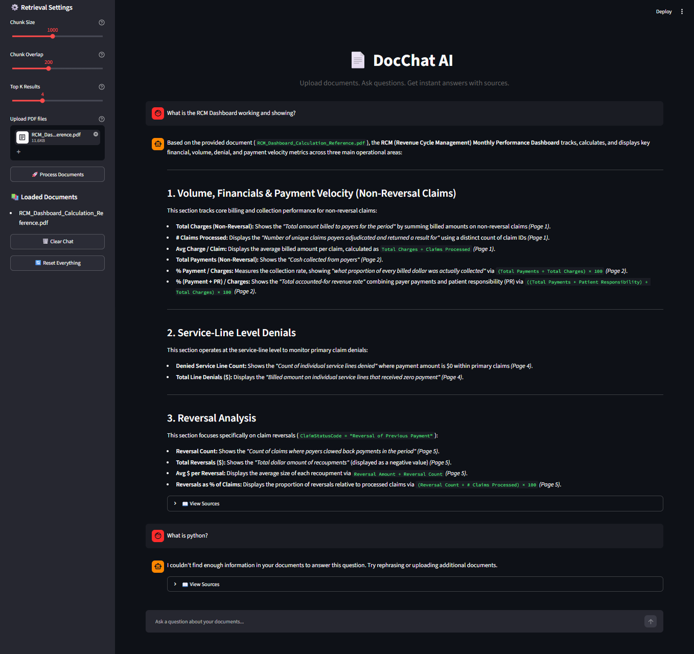

# 📄 DocChat AI — Chat with Your Documents

An intelligent document Q&A system powered by **Retrieval-Augmented Generation (RAG)**. Upload PDFs, ask questions in natural language, and get accurate answers grounded in your document content — with source citations.

---

## The Problem

Organizations sit on massive amounts of unstructured knowledge locked inside PDFs — contracts, reports, policies, research papers, manuals. Finding specific information means manually searching through hundreds of pages. Traditional keyword search misses context. People need answers, not search results.

## The Solution

DocChat AI solves this with a RAG pipeline that:

1. **Ingests** PDF documents and splits them into semantically meaningful chunks
2. **Embeds** each chunk into a high-dimensional vector space using OpenAI embeddings
3. **Stores** the vectors in a ChromaDB vector database for fast similarity search
4. **Retrieves** the most relevant chunks when a user asks a question
5. **Generates** a precise, contextual answer using an LLM — grounded in the actual document content, not hallucinated

Every answer includes source citations so users can verify the information against the original document.

---

## Architecture

```
┌──────────────┐     ┌──────────────────┐     ┌─────────────────┐
│  PDF Upload  │────▶│  Text Extraction │────▶│  Text Chunking  │
└──────────────┘     │    (PyPDF2)      │     │  (LangChain     │
                     └──────────────────┘     │   Recursive)    │
                                              └────────┬────────┘
                                                       │
                                                       ▼
                                              ┌─────────────────┐
                                              │   Embedding     │
                                              │  (OpenAI text-  │
                                              │  embedding-3)   │
                                              └────────┬────────┘
                                                       │
                                                       ▼
┌──────────────┐     ┌──────────────────┐     ┌─────────────────┐
│   Answer +   │◀────│   LLM Generation │◀────│  Vector Search  │
│   Sources    │     │   (GPT-4o-mini)  │     │   (ChromaDB)    │
└──────────────┘     └──────────────────┘     └─────────────────┘
       ▲                                              ▲
       │                                              │
       │              ┌──────────────────┐            │
       └──────────────│   User Question  │────────────┘
                      └──────────────────┘
```

---

## Features

- **Multi-PDF Support** — Upload and query across multiple documents simultaneously
- **Source Citations** — Every answer shows which document sections it's based on
- **Configurable Chunking** — Adjust chunk size and overlap for different document types
- **Model Selection** — Choose between GPT-4o-mini, GPT-4o, or GPT-3.5-turbo
- **Conversation History** — Full chat history maintained during the session
- **Retrieval Tuning** — Adjust the number of retrieved chunks (Top-K) per query
- **Clean UI** — Streamlit-based interface with intuitive document upload and chat

---

## Tech Stack

| Component          | Technology                          |
|--------------------|-------------------------------------|
| RAG Framework      | LangChain                           |
| Vector Database    | ChromaDB                            |
| Embeddings         | OpenAI text-embedding-3-small       |
| LLM                | GPT-4o-mini (configurable)          |
| Text Extraction    | PyPDF2                              |
| Frontend           | Streamlit                           |
| Language           | Python 3.10+                        |

---

## Project Structure

```
docchat-ai/
├── app/
│   ├── __init__.py
│   └── main.py                 # Streamlit application
├── utils/
│   ├── __init__.py
│   ├── config.py               # Configuration management
│   ├── document_processor.py   # PDF extraction & text chunking
│   └── rag_chain.py            # RAG pipeline & query logic
├── data/                       # Directory for sample PDFs
├── .env.example                # Environment variables template
├── .gitignore
├── requirements.txt            # Python dependencies
└── README.md
```

---

## Getting Started

### Prerequisites

- Python 3.10 or higher
- OpenAI API key ([Get one here](https://platform.openai.com/api-keys))

### Installation

```bash
# 1. Clone the repository
git clone https://github.com/M-Ahmed-Mirza/docchat-ai.git
cd docchat-ai

# 2. Create a virtual environment
python -m venv venv
source venv/bin/activate        # On Windows: venv\Scripts\activate

# 3. Install dependencies
pip install -r requirements.txt

# 4. Set up environment variables
cp .env.example .env
# Edit .env and add your OpenAI API key

# 5. Run the application
streamlit run app/main.py
```

The app will open in your browser at `http://localhost:8501`.

### Usage

1. Enter your OpenAI API key in the sidebar (or set it in `.env`)
2. Upload one or more PDF files
3. Click **"Process Documents"** to index them
4. Start asking questions in the chat interface
5. View source citations by expanding the **"View Sources"** section under each answer

---

## How It Works

### 1. Document Processing
PDFs are loaded and text is extracted page by page using PyPDF2. The raw text is then split into overlapping chunks using LangChain's `RecursiveCharacterTextSplitter`, which preserves paragraph and sentence boundaries for better context retention.

### 2. Embedding & Storage
Each text chunk is converted into a 1536-dimensional vector using OpenAI's `text-embedding-3-small` model. These vectors are stored in a ChromaDB collection, enabling fast cosine similarity search.

### 3. Retrieval
When a user asks a question, the question is embedded using the same model, and the Top-K most similar chunks are retrieved from ChromaDB. This ensures the LLM receives only the most relevant context.

### 4. Generation
The retrieved chunks are formatted into a context string and passed to the LLM along with a system prompt that instructs it to answer only from the provided context. This grounding step prevents hallucination and ensures factual accuracy.

---

## Configuration Options

| Parameter       | Default                  | Description                              |
|----------------|--------------------------|------------------------------------------|
| `MODEL_NAME`    | `gpt-4o-mini`           | LLM model for answer generation          |
| `EMBEDDING_MODEL` | `text-embedding-3-small` | Model for text embeddings              |
| `CHUNK_SIZE`    | `1000`                   | Maximum characters per text chunk        |
| `CHUNK_OVERLAP` | `200`                    | Character overlap between chunks         |
| `TOP_K`         | `4`                      | Number of chunks retrieved per query     |

---

## Screenshots



---

## Future Enhancements

- Support for additional file types (DOCX, TXT, CSV)
- Persistent vector store across sessions
- Multi-user support with authentication
- Hybrid search (keyword + semantic)
- Deployment to cloud (AWS/Azure/GCP)
- Chat export functionality

---

## Author

**Muhammad Ahmed Mirza**  
AI Engineer | [LinkedIn](https://www.linkedin.com/in/muhammad-ahmed-mirza-4282a726b) | [GitHub](https://github.com/M-Ahmed-Mirza)
